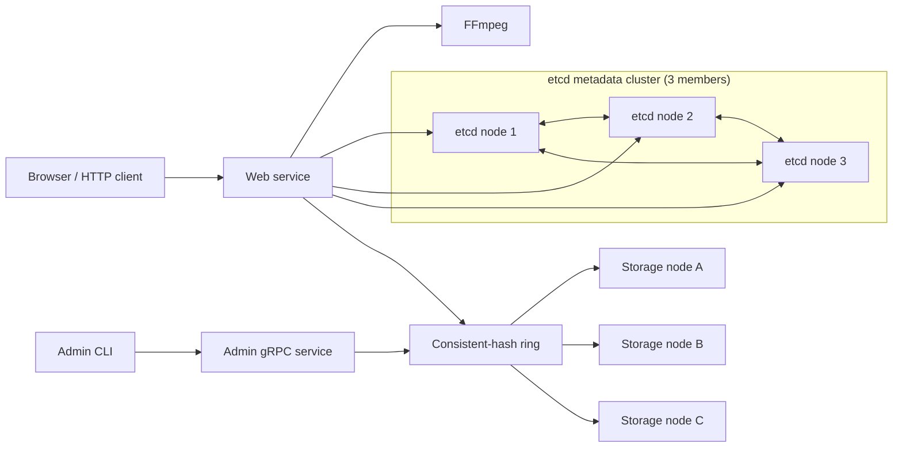

# TritonTube

[](https://github.com/Leon-CYL/TritonTube/actions/workflows/ci.yml)

[](https://go.dev/)

TritonTube is a distributed video-streaming project written in Go. It accepts video uploads, uses FFmpeg to produce MPEG-DASH manifests and segments, stores video content across filesystem-backed gRPC storage nodes and keeps video metadata in etcd.

## Architecture



The web service hashes each `videoID/filename` key and selects the first storage node clockwise on the ring. Adding a node copies only the files reassigned to it. Removing a node copies its files to the next owner before publishing the updated ring.

## Features

- MP4 upload over HTTP
- MPEG-DASH transcoding through FFmpeg
- etcd-backed video metadata
- Filesystem-backed content storage
- Protobuf and gRPC APIs for individual and batch operations
- Consistent-hash placement across storage nodes
- Transactional node membership publication after successful migration
- Concurrent upload workers with partial-failure handling
- Race-safe membership reads and updates
- Unit and in-process gRPC tests

<!-- ## Current limitations

- The hash ring currently uses one point per storage server; virtual nodes are not implemented.
- Each video file has one authoritative owner. Storage replication and automatic failover are not implemented.
- Adding a node copies reassigned files but does not selectively delete the old source copies.
- Upload processing is synchronous; the HTTP request remains open during transcoding and storage.
- The web service supports etcd metadata and network storage only.
- Transport security and authentication are not implemented. -->

## Requirements

- [Go 1.24.1 or newer](https://go.dev/dl/)
- [FFmpeg](https://ffmpeg.org/)
- [etcd](https://etcd.io/)
- `protoc`, `protoc-gen-go`, and `protoc-gen-go-grpc` when regenerating protobuf code

On macOS with Homebrew:

```bash
brew install ffmpeg etcd protobuf
```

Install the Go protobuf generators:

```bash
go install google.golang.org/protobuf/cmd/protoc-gen-go@latest
go install google.golang.org/grpc/cmd/protoc-gen-go-grpc@latest
export PATH="$PATH:$(go env GOPATH)/bin"
```

## Getting started

### 1. Clone and verify the project

```bash
git clone https://github.com/Leon-CYL/TritonTube.git
cd TritonTube
go mod download
make test
```

### 2. Start etcd

Start a three-member etcd cluster. Run each member in a separate terminal from
the project root.

etcd node 1:

```bash
etcd \
  --name node1 \
  --data-dir ./data1 \
  --initial-advertise-peer-urls http://localhost:2380 \
  --listen-peer-urls http://localhost:2380 \
  --listen-client-urls http://localhost:8093 \
  --advertise-client-urls http://localhost:8093 \
  --initial-cluster-token etcd-cluster-1 \
  --initial-cluster node1=http://localhost:2380,node2=http://localhost:2381,node3=http://localhost:2382 \
  --initial-cluster-state new
```

etcd node 2:

```bash
etcd \
  --name node2 \
  --data-dir ./data2 \
  --initial-advertise-peer-urls http://localhost:2381 \
  --listen-peer-urls http://localhost:2381 \
  --listen-client-urls http://localhost:8094 \
  --advertise-client-urls http://localhost:8094 \
  --initial-cluster-token etcd-cluster-1 \
  --initial-cluster node1=http://localhost:2380,node2=http://localhost:2381,node3=http://localhost:2382 \
  --initial-cluster-state new
```

etcd node 3:

```bash
etcd \
  --name node3 \
  --data-dir ./data3 \
  --initial-advertise-peer-urls http://localhost:2382 \
  --listen-peer-urls http://localhost:2382 \
  --listen-client-urls http://localhost:8095 \
  --advertise-client-urls http://localhost:8095 \
  --initial-cluster-token etcd-cluster-1 \
  --initial-cluster node1=http://localhost:2380,node2=http://localhost:2381,node3=http://localhost:2382 \
  --initial-cluster-state new
```

This local cluster demonstrates etcd quorum and tolerance of one member-process
failure. Because all members run on the same machine, it does not provide
machine-level high availability. Production members should run in separate
failure domains.

### 3. Start storage nodes

Run each command in a separate terminal:

```bash
go run ./cmd/storage --host localhost --port 8090 ./storage/8090
```

```bash
go run ./cmd/storage --host localhost --port 8091 ./storage/8091
```

```bash
go run ./cmd/storage --host localhost --port 8092 ./storage/8092
```

### 4. Start the web and admin services

The first network address is the admin gRPC listener. The remaining addresses are the initial storage nodes.

```bash
go run ./cmd/web \
  --host localhost \
  --port 8080 \
  etcd "localhost:8093,localhost:8094,localhost:8095" \
  nw "localhost:3343,localhost:8090,localhost:8091,localhost:8092"
```

Open [http://localhost:8080](http://localhost:8080).

## Storage administration

Use the admin CLI against the admin gRPC address:

```bash
# List storage nodes
go run ./cmd/admin list localhost:3343

# Start a new storage process before adding it to the hash ring
go run ./cmd/storage --host localhost --port 8096 ./storage/8096

# In another terminal, verify, migrate, and add the running node
go run ./cmd/admin add localhost:3343 localhost:8096

# Migrate and remove the node from the hash ring
go run ./cmd/admin remove localhost:3343 localhost:8096
```

The web service manages storage membership and data migration, but it does not
start or stop storage processes. After a successful removal, stop that storage
process separately with `Ctrl-C`. Web and storage processes handle `SIGINT` and
`SIGTERM` with graceful shutdown.

## Development

### Tests

```bash
make test
make race
```

Run a specific package:

```bash
go test -v ./internal/storage
go test -v ./internal/web
```

### Coverage

Generate the whole-module coverage report:

```bash
make coverage
```

### Protobuf generation

Source definitions live in [`proto/`](proto/). Regenerate all Go protobuf and gRPC files with:

```bash
make proto
```

Generated files are written to [`internal/proto/`](internal/proto/).
