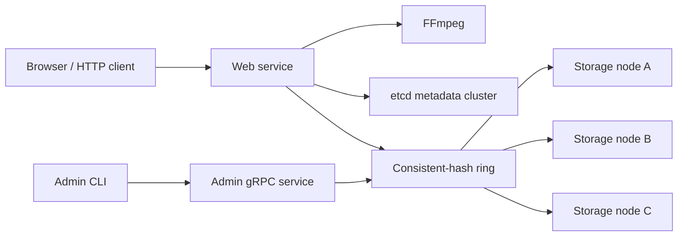

# TritonTube

[](https://github.com/Leon-CYL/TritonTube/actions/workflows/ci.yml)

[](https://go.dev/)

TritonTube is a distributed video-streaming project written in Go. It accepts video uploads, uses FFmpeg to produce MPEG-DASH manifests and segments, stores video content across filesystem-backed gRPC storage nodes, and keeps video metadata in etcd.

The project is currently focused on correctness, automated testing, and safe storage-node membership changes.

## Architecture



The web service hashes each `videoID/filename` key and selects the first storage node clockwise on the ring. Adding a node copies only the files reassigned to it. Removing a node copies its files to the next owner before publishing the updated ring.

## Features

- MP4 upload over HTTP
- MPEG-DASH transcoding through FFmpeg
- etcd-backed video metadata
- Filesystem-backed content storage
- Protobuf and gRPC APIs for individual and batch operations
- Consistent-hash placement across storage nodes
- Transactional node membership publication after successful migration
- Concurrent upload workers with partial-failure handling
- Race-safe membership reads and updates
- Unit and in-process gRPC tests
- GitHub Actions checks for formatting, vet, tests, race detection, and coverage

## Current limitations

- The hash ring currently uses one point per storage server; virtual nodes are not implemented.
- Each video file has one authoritative owner. Storage replication and automatic failover are not implemented.
- Adding a node copies reassigned files but does not selectively delete the old source copies.
- Upload processing is synchronous; the HTTP request remains open during transcoding and storage.
- The web service supports etcd metadata and network storage only.
- Transport security and authentication are not implemented.

## Requirements

- [Go 1.24.1 or newer](https://go.dev/dl/)
- [FFmpeg](https://ffmpeg.org/)
- [etcd](https://etcd.io/)
- `protoc`, `protoc-gen-go`, and `protoc-gen-go-grpc` when regenerating protobuf code

On macOS with Homebrew:

```bash
brew install ffmpeg etcd protobuf
```

Install the Go protobuf generators:

```bash
go install google.golang.org/protobuf/cmd/protoc-gen-go@latest
go install google.golang.org/grpc/cmd/protoc-gen-go-grpc@latest
export PATH="$PATH:$(go env GOPATH)/bin"
```

## Getting started

### 1. Clone and verify the project

```bash
git clone https://github.com/Leon-CYL/TritonTube.git
cd TritonTube
go mod download
make test
```

### 2. Start etcd

For local development, start a single etcd node:

```bash
etcd \
  --name tritontube-etcd \
  --data-dir ./data/etcd \
  --listen-client-urls http://localhost:2379 \
  --advertise-client-urls http://localhost:2379
```

### 3. Start storage nodes

Run each command in a separate terminal:

```bash
go run ./cmd/storage --host localhost --port 8090 ./storage/8090
```

```bash
go run ./cmd/storage --host localhost --port 8091 ./storage/8091
```

```bash
go run ./cmd/storage --host localhost --port 8092 ./storage/8092
```

### 4. Start the web and admin services

The first network address is the admin gRPC listener. The remaining addresses are the initial storage nodes.

```bash
go run ./cmd/web \
  --host localhost \
  --port 8080 \
  etcd "localhost:2379" \
  nw "localhost:3343,localhost:8090,localhost:8091,localhost:8092"
```

Open [http://localhost:8080](http://localhost:8080).

## Storage administration

Use the admin CLI against the admin gRPC address:

```bash
# List storage nodes
go run ./cmd/admin list localhost:3343

# Add a storage node
go run ./cmd/admin add localhost:3343 localhost:8093

# Remove a storage node
go run ./cmd/admin remove localhost:3343 localhost:8093
```

The current `AddNode` implementation starts the new storage server inside the web-service process. Removing the final storage node is rejected.

## Development

### Formatting and static analysis

```bash
find . -type f -name '*.go' -exec gofmt -w {} +
make vet
```

### Tests

```bash
make test
make race
```

Run a specific package:

```bash
go test -v ./internal/storage
go test -v ./internal/web
```

### Coverage

Generate the whole-module coverage report:

```bash
make coverage
```

Generate an interactive HTML report:

```bash
make coverage-html
```

Core-package coverage, which excludes command entrypoints and generated protobuf files:

```bash
go test \
  -coverprofile=coverage.out \
  ./internal/storage ./internal/web
go tool cover -func=coverage.out
```

The badge at the top of this README reflects the current core-package statement coverage. CI uploads `coverage.out` as a workflow artifact.

### Protobuf generation

Source definitions live in [`proto/`](proto/). Regenerate all Go protobuf and gRPC files with:

```bash
make proto
```

Generated files are written to [`internal/proto/`](internal/proto/).

## Project layout

```text
.
├── cmd/
│   ├── admin/          # Storage membership CLI
│   ├── storage/        # Storage-node process
│   └── web/            # HTTP and admin-service process
├── internal/
│   ├── proto/          # Generated protobuf and gRPC code
│   ├── storage/        # Filesystem storage service and tests
│   └── web/            # HTTP, etcd, hash ring, and migration logic
├── proto/              # Protobuf service definitions
├── .github/workflows/  # Continuous integration
├── Makefile
└── go.mod
```

## Continuous integration

The GitHub Actions workflow runs on pushes, pull requests, and manual dispatches. It verifies:

1. `gofmt`
2. `go vet ./...`
3. `go test ./...`
4. `go test -race ./...`
5. Core-package coverage generation

The coverage profile is retained as a workflow artifact for 14 days.
