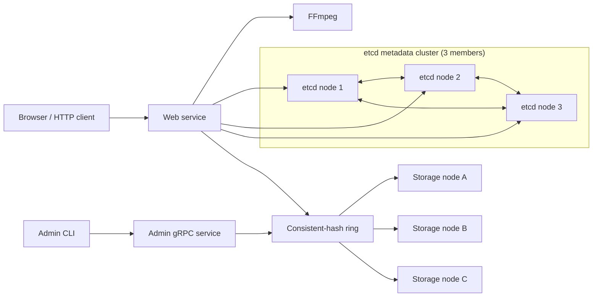

# TritonTube

[](https://github.com/Leon-CYL/TritonTube/actions/workflows/ci.yml)

[](https://go.dev/)

TritonTube is a distributed video-streaming application written in Go. It
transcodes uploaded videos into MPEG-DASH content with FFmpeg, distributes
manifests and segments across filesystem-backed gRPC storage nodes using
consistent hashing, and stores video metadata in an etcd cluster. A Redis
cache accelerates popular segment reads, while bounded concurrent batching
improves uploads and storage-node migration.

## Performance

### Baseline vs. optimized file operations

| Operation | Baseline | Optimized | Improvement |
| --- | --- | --- | --- |
| Files Upload | 2,509.92 ms | 1,761.00 ms | 1.43x faster |
| Files Migration | 1,182.80 ms | 821.44 ms | 1.44x faster |

### Video segment cache

Random-access workload across three 15-minute videos: 80% of requests target
the first 20% of each video's segments and 20% target the remaining segments.
Each result is a 60-second `wrk` run. Warm-cache runs use a 30-second warm-up
with the same concurrency before measurement.

| Cache state | Concurrency | Requests/sec | p50 latency | p99 latency | Timeouts | Cache hit rate |
| --- | ---: | ---: | ---: | ---: | ---: | ---: |
| Baseline | 1 | 66.67 | 14.08 ms | 35.91 ms | 0 | N/A |
| Baseline | 10 | 93.62 | 101.31 ms | 252.85 ms | 0 | N/A |
| Baseline | 50 | 86.65 | 520.19 ms | 1010 ms | 0 | N/A |
| Cold cache | 1 | 87.97 | 9.70 ms | 39.45 ms | 0 | 83.73% |
| Cold cache | 10 | 110.43 | 86.74 ms | 186.40 ms | 0 | 88.62% |
| Cold cache | 50 | 115.93 | 400.92 ms | 982.23 ms | 0 | 91.43% |
| Warm cache | 1 | 95.69 | 9.30 ms | 25.49 ms | 0 | 86.87% |
| Warm cache | 10 | 111.79 | 87.82 ms | 140.56 ms | 0 | 93.86% |
| Warm cache | 50 | 116.41 | 398.54 ms | 974.88 ms | 0 | 98.12% |

## Architecture



The web service hashes each `videoID/filename` key and selects the first storage node clockwise on the ring. Adding a node copies only the files reassigned to it. Removing a node copies its files to the next owner before publishing the updated ring.

Uploads use a bounded pool of at most 64 workers. Each worker reads up to four
DASH files and sends them with batch gRPC writes, grouped by their storage-node
owner. Node migration uses up to eight concurrent workers with bounded batches
of four files for both `ReadFiles` and `WriteFiles`. Small batches keep requests
below the configured 16 MiB gRPC message limit while concurrency overlaps file
I/O, protobuf processing, and network transfer.

## Requirements

- [Go 1.24.1 or newer](https://go.dev/dl/)
- [FFmpeg](https://ffmpeg.org/)
- [etcd](https://etcd.io/) for host-based local runs
- [Docker](https://docs.docker.com/engine/install/) with Docker Compose for containerized runs
- `protoc`, `protoc-gen-go`, and `protoc-gen-go-grpc` when regenerating protobuf code

On macOS with Homebrew:

```bash
brew install ffmpeg etcd protobuf
```

Install the Go protobuf generators:

```bash
go install google.golang.org/protobuf/cmd/protoc-gen-go@latest
go install google.golang.org/grpc/cmd/protoc-gen-go-grpc@latest
export PATH="$PATH:$(go env GOPATH)/bin"
```

## Docker commands

Docker Compose starts Redis, three etcd members, three persistent storage nodes,
and the web service. Ports `8080` and `6379` are published to the host.

### Start the application

Build the images and start the complete application in the background:

```bash
docker compose up --build --detach
```

Open [http://localhost:8080](http://localhost:8080).

View container status and follow logs:

```bash
docker compose ps
docker compose logs --follow
```

### Profile upload and content-read latency

Start the application and follow the web and storage logs:

```bash
docker compose up --build --detach
docker compose logs --follow web storage1 storage2 storage3
```

In another terminal, upload the normalized 15-minute benchmark video. Use a
new filename for every run because the filename determines the video ID.

The benchmark file is generated locally and is ignored by Git. Create it
before running the upload command (this can take several minutes):

```bash
mkdir -p data/benchmark
ffmpeg \
  -f lavfi -i 'testsrc2=size=1280x720:rate=30' \
  -f lavfi -i 'sine=frequency=1000:sample_rate=48000' \
  -t 00:15:00 \
  -c:v libx264 -preset veryfast -pix_fmt yuv420p \
  -c:a aac -b:a 128k \
  -movflags +faststart \
  data/benchmark/15.mp4
```

If you already have a suitable video, copy it to `data/benchmark/15.mp4`
instead. Confirm that the file exists with `ls -lh data/benchmark/15.mp4`.

```bash
curl \
  --silent \
  --show-error \
  --output /dev/null \
  --write-out '%{http_code} %{size_upload} %{time_total}\n' \
  --form "file=@data/benchmark/15.mp4;filename=bench-15-profile-1.mp4" \
  http://localhost:8080/upload |
awk '{printf "HTTP status: %s\nUploaded bytes: %s\nClient time: %.3f ms\n", $1, $2, $3 * 1000}'
```

After the upload succeeds, profile a manifest read:

```bash
curl \
  --silent \
  --show-error \
  --output /dev/null \
  --write-out '%{http_code} %{size_download} %{time_total}\n' \
  http://localhost:8080/content/bench-15-profile-1/manifest.mpd |
awk '{printf "HTTP status: %s\nDownloaded bytes: %s\nClient time: %.3f ms\n", $1, $2, $3 * 1000}'
```

Profile a DASH segment read:

```bash
curl \
  --silent \
  --show-error \
  --output /dev/null \
  --write-out '%{http_code} %{size_download} %{time_total}\n' \
  http://localhost:8080/content/bench-15-profile-1/chunk-0-00001.m4s |
awk '{printf "HTTP status: %s\nDownloaded bytes: %s\nClient time: %.3f ms\n", $1, $2, $3 * 1000}'
```


### Stop the application

Stop and remove the containers and network while preserving uploaded videos
and metadata in named volumes:

```bash
docker compose down
```

To also delete all persisted TritonTube data and start clean:

```bash
docker compose down --volumes
```

### Docker admin commands

The admin CLI runs as an on-demand container under the `tools` profile:

```bash
# List storage nodes
docker compose --profile tools run --rm admin list web:3343

# Remove storage3 from the hash ring after migrating its files
docker compose --profile tools run --rm admin remove web:3343 storage3:8090

# Add the still-running storage3 process back to the hash ring
docker compose --profile tools run --rm admin add web:3343 storage3:8090
```

Adding a node requires its storage container to already be running. Removing a
node updates membership and migrates its files, but does not stop its container.

### Profile node file transfers

Build and start the application, then follow the web and storage logs:

```bash
docker compose up --build --detach
docker compose logs --follow web storage1 storage2 storage3
```

In another terminal, confirm the current storage membership:

```bash
docker compose --profile tools run --rm admin list web:3343
```

Profile batched file transfer while removing `storage3`:

```bash
docker compose --profile tools run --rm \
  admin remove web:3343 storage3:8090
```

Profile batched file transfer while adding `storage3` back:

```bash
docker compose --profile tools run --rm \
  admin add web:3343 storage3:8090
```

Keep the `storage3` container running during both operations. The web logs
report `ListFiles`, batch `ReadFiles`, batch `WriteFiles`, total migration,
average-per-file, and complete operation latency in milliseconds.

### Run tests in Docker

Run all tests in an isolated Go builder container:

```bash
docker compose --profile test run --rm test
```

Run the race detector or a specific package by overriding the test service's
default command:

```bash
docker compose --profile test run --rm test go test -race ./...
docker compose --profile test run --rm test go test -v ./internal/web
```

## Local commands

These commands run TritonTube directly on the host without Docker.

### 1. Clone and test the project

```bash
git clone https://github.com/Leon-CYL/TritonTube.git
cd TritonTube
go mod download
make test
```

### 2. Start etcd

Start a three-member etcd cluster. Run each member in a separate terminal from
the project root.

etcd node 1:

```bash
etcd \
  --name node1 \
  --data-dir ./data1 \
  --initial-advertise-peer-urls http://localhost:2380 \
  --listen-peer-urls http://localhost:2380 \
  --listen-client-urls http://localhost:8093 \
  --advertise-client-urls http://localhost:8093 \
  --initial-cluster-token etcd-cluster-1 \
  --initial-cluster node1=http://localhost:2380,node2=http://localhost:2381,node3=http://localhost:2382 \
  --initial-cluster-state new
```

etcd node 2:

```bash
etcd \
  --name node2 \
  --data-dir ./data2 \
  --initial-advertise-peer-urls http://localhost:2381 \
  --listen-peer-urls http://localhost:2381 \
  --listen-client-urls http://localhost:8094 \
  --advertise-client-urls http://localhost:8094 \
  --initial-cluster-token etcd-cluster-1 \
  --initial-cluster node1=http://localhost:2380,node2=http://localhost:2381,node3=http://localhost:2382 \
  --initial-cluster-state new
```

etcd node 3:

```bash
etcd \
  --name node3 \
  --data-dir ./data3 \
  --initial-advertise-peer-urls http://localhost:2382 \
  --listen-peer-urls http://localhost:2382 \
  --listen-client-urls http://localhost:8095 \
  --advertise-client-urls http://localhost:8095 \
  --initial-cluster-token etcd-cluster-1 \
  --initial-cluster node1=http://localhost:2380,node2=http://localhost:2381,node3=http://localhost:2382 \
  --initial-cluster-state new
```

### 3. Start storage nodes

Run each command in a separate terminal:

```bash
go run ./cmd/storage --host localhost --port 8090 ./storage/8090
```

```bash
go run ./cmd/storage --host localhost --port 8091 ./storage/8091
```

```bash
go run ./cmd/storage --host localhost --port 8092 ./storage/8092
```

### 4. Start the web and admin services

The first network address is the admin gRPC listener. The remaining addresses are the initial storage nodes.

```bash
go run ./cmd/web \
  --host localhost \
  --port 8080 \
  etcd "localhost:8093,localhost:8094,localhost:8095" \
  nw "localhost:3343,localhost:8090,localhost:8091,localhost:8092"
```

Open [http://localhost:8080](http://localhost:8080).

### Local storage administration

Use the admin CLI against the admin gRPC address:

```bash
# List storage nodes
go run ./cmd/admin list localhost:3343

# Start a new storage process before adding it to the hash ring
go run ./cmd/storage --host localhost --port 8096 ./storage/8096

# In another terminal, verify, migrate, and add the running node
go run ./cmd/admin add localhost:3343 localhost:8096

# Migrate and remove the node from the hash ring
go run ./cmd/admin remove localhost:3343 localhost:8096
```


## Development

### Local tests

```bash
make test
make race
```

Run a specific package:

```bash
go test -v ./internal/storage
go test -v ./internal/web
```

### Coverage

Generate the whole-module coverage report:

```bash
make coverage
```

### Protobuf generation

Source definitions live in [`proto/`](proto/). Regenerate all Go protobuf and gRPC files with:

```bash
make proto
```

Generated files are written to [`internal/proto/`](internal/proto/).
