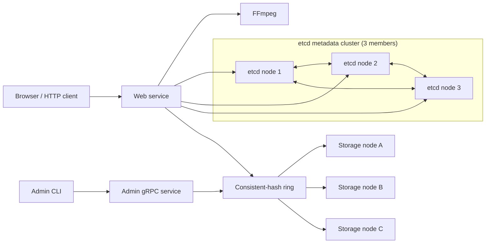

# TritonTube

[](https://github.com/Leon-CYL/TritonTube/actions/workflows/ci.yml)

[](https://go.dev/)

TritonTube is a distributed video-streaming application written in Go. It
transcodes uploaded videos into MPEG-DASH content with FFmpeg, distributes
manifests and segments across filesystem-backed gRPC storage nodes using
consistent hashing, and stores video metadata in an etcd cluster. A Redis
cache accelerates popular segment reads, while bounded concurrent batching
improves uploads and storage-node migration.

## Architecture



## Performance

### Baseline vs. optimized file operations

| Operation | Baseline | Optimized | Improvement |
| --- | --- | --- | --- |
| Files Upload | 2,509.92 ms | 1,761.00 ms | 1.43x faster |
| Files Migration | 1,182.80 ms | 821.44 ms | 1.44x faster |

### Video segment cache

Random-access workload across three 15-minute videos: 80% of requests target
the first 20% of each video's segments and 20% target the remaining segments.
Each result is a 60-second `wrk` run. Warm-cache runs use a 30-second warm-up
with the same concurrency before measurement.

| Cache state | Concurrency | Requests/sec | p50 latency | p99 latency | Timeouts | Cache hit rate |
| --- | ---: | ---: | ---: | ---: | ---: | ---: |
| Baseline | 1 | 66.67 | 14.08 ms | 35.91 ms | 0 | N/A |
| Baseline | 10 | 93.62 | 101.31 ms | 252.85 ms | 0 | N/A |
| Baseline | 50 | 86.65 | 520.19 ms | 1010.00 ms | 0 | N/A |
| Cold cache | 1 | 87.97 | 9.70 ms | 39.45 ms | 0 | 83.73% |
| Cold cache | 10 | 110.43 | 86.74 ms | 186.40 ms | 0 | 88.62% |
| Cold cache | 50 | 115.93 | 400.92 ms | 982.23 ms | 0 | 91.43% |
| Warm cache | 1 | 95.69 | 9.30 ms | 25.49 ms | 0 | 86.87% |
| Warm cache | 10 | 111.79 | 87.82 ms | 140.56 ms | 0 | 93.86% |
| Warm cache | 50 | 116.41 | 398.54 ms | 974.88 ms | 0 | 98.12% |

## Requirements

On macOS with Homebrew:

```bash
brew install ffmpeg etcd protobuf
```

Install the Go protobuf generators:

```bash
go install google.golang.org/protobuf/cmd/protoc-gen-go@latest
go install google.golang.org/grpc/cmd/protoc-gen-go-grpc@latest
export PATH="$PATH:$(go env GOPATH)/bin"
```

## Docker commands


### Start the application

```bash
docker compose up --build --detach
```

Open [http://localhost:8080](http://localhost:8080).

View container status and follow logs:

```bash
docker compose ps
docker compose logs --follow
```

### Local tests

```bash
make test
make race
```

Run a specific package:

```bash
go test -v ./internal/storage
go test -v ./internal/web
```
